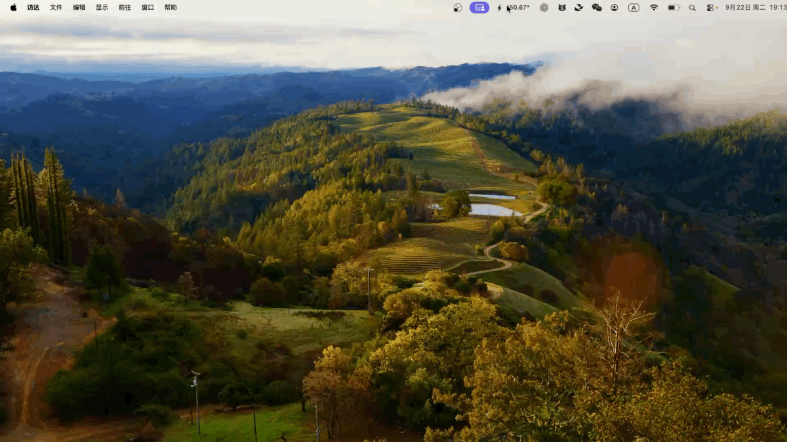

# SuperLight

**Your model usage, quietly in the menu bar.**

[简体中文](README.zh-CN.md) · [Setup guide](docs/configuration.md) · [How estimates work](docs/measurement.md)

SuperLight records local Codex token usage and estimates its API-equivalent cost. A small macOS menu bar label shows today's spend; click it for a dashboard with today, this week, this month, and model prices.

[](docs/media/superlight-demo.mp4)

[Watch the 7-second demo (MP4)](docs/media/superlight-demo.mp4)

- **A quiet desktop app.** No terminal window to keep open. Optional launch at login.
- **Useful detail.** Input, cached input, output, per-model estimates, and reference prices.
- **Local storage.** SQLite records; no prompts, answers, credentials, or tool output saved.
- **Small stack.** Native AppKit + system WebKit; Python standard library backend. No Electron, npm, or runtime Python packages.
- **中文 / English.** Switch the interface language in one click.

## macOS quick start

Requires **macOS 13+**, **Python 3.9+**, and **Xcode Command Line Tools** to build from source.

```bash
# In this repository (one-time build)
make app
open dist/SuperLight.app
```

You can then move `SuperLight.app` into Applications and open it normally. Python must remain installed. The app starts its collector in the background and writes bounded, rotating logs.

1. Click the **ϟ** menu bar label, then **Connect Codex**.
2. Copy the configuration into `~/.codex/config.toml` and restart Codex.
3. Complete a local task. Usage will appear automatically.

Right-click the menu bar label for **Settings**, the data folder, and **Launch at login**. An upstream HTTP proxy is optional; for example, `http://127.0.0.1:7897`. Leave it empty for direct forwarding. Usage collection works independently of forwarding.

## CLI / other platforms

```bash
python3 -m superlight serve --quiet
# In another terminal
python3 -m superlight codex
```

Open [127.0.0.1:12618](http://127.0.0.1:12618) for the same dashboard, or run:

```bash
python3 -m superlight summary --today
python3 -m superlight export > usage.jsonl
```

## What the numbers mean

**USD amounts are estimates, not subscription charges.** Cached input is included in input; reasoning is included in output. Unknown usage or prices remain visibly unknown. Only received usage events are counted.

Weeks start on Monday. Day, week, and month boundaries use the collector's local timezone. Prices are a configurable snapshot, not a live billing feed.

Codex CLI has been tested with ChatGPT login. Desktop **local Codex tasks** can use the same telemetry configuration; remote and cloud tasks need collection on their execution host. Other agents need their own usage adapters.

## Documentation

| Guide | English | 中文 |
|---|---|---|
| Setup, paths, proxy, troubleshooting | [Configuration](docs/configuration.md) | [配置指南](docs/configuration.zh-CN.md) |
| Token counting, prices, coverage | [Measurement](docs/measurement.md) | [统计口径](docs/measurement.zh-CN.md) |

## Development

```bash
make test
make app
```

Tests cover calendar boundaries and DST, pricing, deduplication, persistence, local browser access, proxy forwarding, and Codex event compatibility. The app build is signed locally; a notarized distribution is not included.
